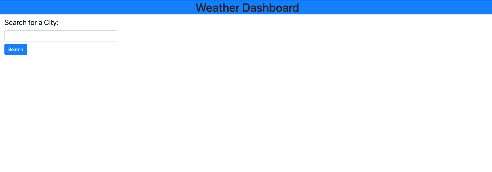
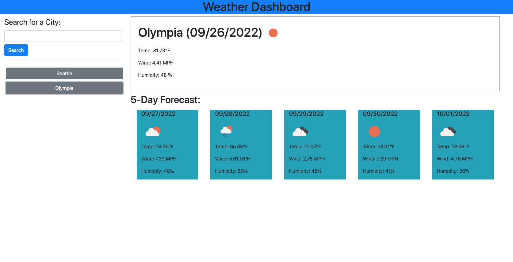

# weather-dashboard

## Description
This webpage provides the user with a simple tool to search for a city and view the weather forcast for the day as well as the next 5 days seeing the temperature, wind speed and humidity. In addition to being able to search for a city the user will be able to easily view the weather for a searched for city by selecting it from the search history below the search button.

## Installation
N/A

## Usage
Deployed application can be found [here](https://braddwagner.github.io/weather-dashboard/)
Upon opening the webpage for the first time the user will be presented with a simple search bar.

The user can then search for any city of their choice and the weather forcast will populate and their selected city will appear below the search bar for easy access to get the weather later. The user will be presented with the weather forcast for the day as well as a 5 day forcast.
.

## Credits
N/A

## License
Please refer to the LICENSE in the repo.